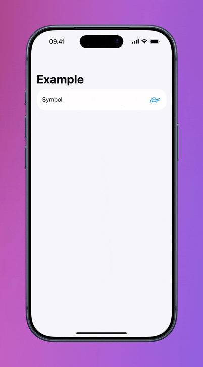

# SFSymbols

<div align="center">
  
  <h4>SFSymbols gives you a ready-to-use symbol picker for SwiftUI and an API for reading the SF Symbols catalog. Use it to let users pick symbols in-app, or to build your own symbol browsing UI.</h4>
</div>

- [Getting Started](#getting-started)
  - [Step 1: Add the SFSymbols Swift Package](#step-1-add-the-sfsymbols-swift-package)
  - [Step 2: Use SFSymbolPicker](#step-2-use-sfsymbolpicker)
  - [Step 3: Present the Picker With .sfSymbolPicker](#step-3-present-the-picker-with-sfsymbolpicker)
  - [Step 4: Load and Browse Symbols With SFSymbols](#step-4-load-and-browse-symbols-with-sfsymbols)
- [Example Project](#example-project)

## Getting Started

This section walks through adding SFSymbols and using the three primary APIs.

### Step 1: Add the SFSymbols Swift Package

Add SFSymbols to your Xcode project or Swift package.

```swift
let package = Package(
    dependencies: [
        .package(url: "https://github.com/simonbs/SFSymbols.git", branch: "main")
    ]
)
```

### Step 2: Use SFSymbolPicker

`SFSymbolPicker` is a SwiftUI view that presents a labeled row with a button showing the current symbol.

```swift
import SFSymbols
import SwiftUI

struct ContentView: View {
    @State private var selectedSymbol = "tortoise"

    var body: some View {
        Form {
            SFSymbolPicker("Symbol", selection: $selectedSymbol)
        }
    }
}
```

`SFSymbolPicker` accepts both optional and non-optional bindings. Optional bindings let you clear the selection.

### Step 3: Present the Picker With .sfSymbolPicker(...)

Use the view modifier when you want full control over the button or the presentation trigger.

```swift
import SFSymbols
import SwiftUI

struct ContentView: View {
    @State private var isPresented = false
    @State private var selectedSymbol: String?

    var body: some View {
        Button {
            isPresented = true
        } label: {
            Label("Pick a Symbol", systemImage: selectedSymbol ?? "questionmark")
        }
        .sfSymbolPicker(isPresented: $isPresented, selection: $selectedSymbol)
    }
}
```

`.sfSymbolPicker` can be attached to any view, including images, list rows, or custom buttons.

### Step 4: Load and Browse Symbols With SFSymbols

`SFSymbols` loads the system catalog asynchronously. Use it to build custom filters, category views, or search.

```swift
import SFSymbols
import SwiftUI

struct SymbolBrowser: View {
    @State private var symbols: SFSymbols?

    var body: some View {
        List {
            if let symbols {
                ForEach(symbols.categories) { category in
                    Section(category.key) {
                        ForEach(category.symbols) { symbol in
                            Label(symbol.name, systemImage: symbol.name)
                        }
                    }
                }
            }
        }
        .task {
            symbols = try? await SFSymbols()
        }
    }
}
```

`SFSymbols` exposes the full list of symbols and their categories.

```swift
let symbols = try await SFSymbols()
let allSymbols = symbols.symbols
let categories = symbols.categories
```

Each `SFSymbol` includes its `name`, `searchTerms`, and `categories`, so you can build your own search and filtering UI.

## Example Project

Open the example app in `Example/Example.xcodeproj` to see `SFSymbolPicker` in a simple form.
